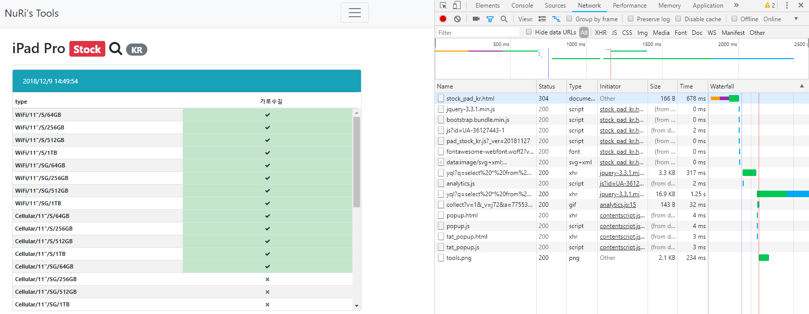
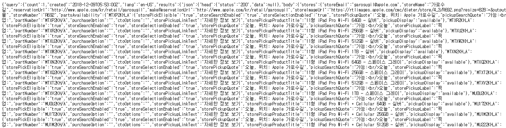

# apple_pickup_postman

## Introduction

2018년 12월 7일, ipad pro 3세대가 한국에  출시한다는 소식을 접했다. 필자는 원래 아이패드 프로 1세대 12.9인치 wifi 모델 + 스마트 키보드 + 애플 펜슬 1세대를 사용중이었는데, **너무 무거워서 갖고 다닐 수 없다는 점과 애플 펜슬의 괴랄한 충전 방식**이 마음에 들지 않았다. 마침 지난 애플 키노트에서 아이패드 3세대가 발표되었고, **가볍고 본체에 자석으로 붙여서 애플 펜슬을 충전할 수 있는 11인치 모델**을 눈여겨 보고 있었다. 

유튜브에서 제품 리뷰를 살펴보다 보니 어느새 출시 2주 전부터 아이패드에 꽂혀버렸고, 하루라도 빨리 아이패드를 갖고 싶어지는 애플병에 걸리고 말았다.  출시 약 5일 전 공홈
 (https://www.apple.com/kr) 에서 제품을 구매할 수 있게 되었으나, 조금 늦게 홈페이지를 확인하여 주문을 완료하니 본체 배송이 무려 12월 18일 ~ 21일 로 출시 후 배송까지 2주정도 소요되게 되었다. 심지어 애플 펜슬과 스마트 폴리어 커버, 본체 모두 배송 날짜가 달라서 따로따로 받게 될 상황에 놓였다. 

이런 상황을 도저히 참지 못하고 (...) 12월 7일에 가로수길 픽업이 가능해지면 공홈에서 주문하기로 마음을 먹었다. 하지만 공홈에서 픽업 가능 주문이 언제 열릴지 알 수 없다는 점 때문에, 조금이라도 늦으면 지난번처럼 또 2주 이상 기다리게 될 것 같은 기분이 들었다. 역대 애플 제품들의 사례를 봐도
 오전 6시, 오전 7시, 오후 1시 등 오픈 시간이 일관되지 않았다고 한다. 

공홈 장바구니를 새로고침하며 밤을 새면서 기다려야하나 하던 중, 웹 서핑를 통해 가로수길 애플스토어의 애플워치와 아이패드 프로 3세대의 제고를 확인할 수 있는 사이트
 ( [https://nuridol.net/stock_pad_kr.html](https://nuridol.net/stock_pad_kr.html) ) 를 찾게 되었고, 이 사이트를 활용해서 특정 제품의 픽업 주문이 가능해지면 내게 알림을 주는 프로그램을 만들어서 돌려놓고 자야겠다는 생각을 하게 되었다. 

## Program design

먼저 프로그램을 어떻게 구상할지 생각해보자. 일단 언어는 필자에게 가장 익숙하고 인터넷에 정보가 많은 만능 언어, python 을 사용하기로 한다. 

그리고 픽업 주문이 가능해졌을 때, 내게 어떤 방식으로든 알림을 줄 방법을 생각해야한다. 처음에는 푸시 알림을 생각했는데, 아이폰을 사용하고 있는지라 검색해보니 생각보다 쉽지 않아 보였다. 따라서 gmail 앱의 실시간 메일 알림 기능을 믿고, 내게 **메일을 보내는 방식으로 알림**을 주기로 결정했다. 

프로그램은 크게 두 기능을 하는 모듈 필요하다.

1. 가로수길 애플스토어에서 어떤 제품의 당일 픽업 주문을 공홈에서 할 수 있는지 판단해주는 모듈
2. 어떤 조건이 만족되면 내게 이메일을 보내주는 모듈

이를 바탕으로 main 함수를 작성해보자. 다음은 INTERVAL 초 마다 MODEL 의 픽업 주문이 가능한지 확인하고, 만약 가능하다면 내게 email 을 보내고 종료되는 메인 함수이다.
```
def main():
  while(is_pickup_possible(MODEL) == False):
    time.sleep(INTERVAL)
  mail_me(MODEL)
```
이제 각 함수의 내부를 채워보자.

## Function#1. is_pickup_possible()

첫 번째 함수에서 쓰일 데이터를 얻기 위해 nuridol 사이트를 참고해보자. 웹 개발은 잘 못하지만 어디서 본건 좀 있어서 웹 페이지가 어디로 어떤 요청을 보내는지 뜯어볼 줄은 안다. [https://nuridol.net/stock_pad_kr.html](https://nuridol.net/stock_pad_kr.html) 에 접속하여 개발자도구로 들어가고, network 탭을 눌러보자. 그리고 새로고침을 해보자. 



yql?q=select ... 하는 요청이 제일 시간이 많이 걸린 것으로 보아 아마도 각 제품의 매장 재고를 가져오는 요청인 것 같다. 우리의 예상이 맞는지 확인 해보기 위해 더블클릭을 하여 요청 결과를 보자.



맞는 것 같다. 이 사이트는 어디론가 yql query 를 날려서 받아온 정보를 렌더링 해주고 있는 것이다. 다음은 yql query 문을 복사해온 것이다. 

- [https://query.yahooapis.com/v1/public/yql?q=select * from json where url%3D"https%3A%2F%2Fwww.apple.com%2Fkr%2Fshop%2Fretail%2Fpickup-message%3Fpl%3Dtrue%26searchNearby%3Dtrue%26store%3DR692%26parts.0%3DMTXP2KH%2FA%26parts.1%3DMTXR2KH%2FA%26parts.2%3DMTXU2KH%2FA%26parts.3%3DMTXW2KH%2FA%26parts.4%3DMTXN2KH%2FA%26parts.5%3DMTXQ2KH%2FA%26parts.6%3DMTXT2KH%2FA%26parts.7%3DMTXV2KH%2FA%26parts.8%3DMU0U2KH%2FA%26parts.9%3DMU172KH%2FA%26parts.10%3DMU1M2KH%2FA%26parts.11%3DMU222KH%2FA%26parts.12%3DMU0M2KH%2FA%26parts.13%3DMU102KH%2FA%26parts.14%3DMU1F2KH%2FA%26parts.15%3DMU1V2KH%2FA%26parts.16%3DMTEM2KH%2FA%26parts.17%3DMTFN2KH%2FA%26parts.18%3DMTFQ2KH%2FA%26parts.19%3DMTFT2KH%2FA%26parts.20%3DMTEL2KH%2FA%26parts.21%3DMTFL2KH%2FA%26parts.22%3DMTFP2KH%2FA%26parts.23%3DMTFR2KH%2FA%26parts.24%3DMTHP2KH%2FA%26parts.25%3DMTJ62KH%2FA%26parts.26%3DMTJJ2KH%2FA%26parts.27%3DMTJV2KH%2FA%26parts.28%3DMTHJ2KH%2FA%26parts.29%3DMTHV2KH%2FA%26parts.30%3DMTJD2KH%2FA%26parts.31%3DMTJP2KH%2FA"&format=json&_=1544334592805](https://query.yahooapis.com/v1/public/yql?q=select%20*%20from%20json%20where%20url%3D%22https%3A%2F%2Fwww.apple.com%2Fkr%2Fshop%2Fretail%2Fpickup-message%3Fpl%3Dtrue%26searchNearby%3Dtrue%26store%3DR692%26parts.0%3DMTXP2KH%2FA%26parts.1%3DMTXR2KH%2FA%26parts.2%3DMTXU2KH%2FA%26parts.3%3DMTXW2KH%2FA%26parts.4%3DMTXN2KH%2FA%26parts.5%3DMTXQ2KH%2FA%26parts.6%3DMTXT2KH%2FA%26parts.7%3DMTXV2KH%2FA%26parts.8%3DMU0U2KH%2FA%26parts.9%3DMU172KH%2FA%26parts.10%3DMU1M2KH%2FA%26parts.11%3DMU222KH%2FA%26parts.12%3DMU0M2KH%2FA%26parts.13%3DMU102KH%2FA%26parts.14%3DMU1F2KH%2FA%26parts.15%3DMU1V2KH%2FA%26parts.16%3DMTEM2KH%2FA%26parts.17%3DMTFN2KH%2FA%26parts.18%3DMTFQ2KH%2FA%26parts.19%3DMTFT2KH%2FA%26parts.20%3DMTEL2KH%2FA%26parts.21%3DMTFL2KH%2FA%26parts.22%3DMTFP2KH%2FA%26parts.23%3DMTFR2KH%2FA%26parts.24%3DMTHP2KH%2FA%26parts.25%3DMTJ62KH%2FA%26parts.26%3DMTJJ2KH%2FA%26parts.27%3DMTJV2KH%2FA%26parts.28%3DMTHJ2KH%2FA%26parts.29%3DMTHV2KH%2FA%26parts.30%3DMTJD2KH%2FA%26parts.31%3DMTJP2KH%2FA%22&format=json&_=1544334592805)

쿼리문이 엄청 길다. 대충 살펴보니 yahoo 에서 제공하는 yql api 를 사용하고 있다. YQL 은 yahoo query language 의 약자로, 특정 url 에다가 마치 DB select 문을 날리듯 쿼리를 날려서 데이터를 가져올 수 있는 api 인 것 같다. 포멧은 json 형태로 가져오게 된다. 그리고 R692 는 매장 이름, MU1F2KH_A 등은 제품명인 것 같다. 우리도 이 쿼리문을 사용하도록 하자.

파이썬 기본 제공 라이브러리 중 특정 url 로 요청을 보낼 수 있는 requests 라는 모듈이 있다. 바로 함수를 작성해보자. 
```
def is_pickup_possible(model):
  r = requests.get(URL)
  d = r.json()
  if r.status_code == 200 and d is not None:
    try:
      product_info = d['query']['results']['json']['body']['stores']['partsAvailability'][model]
      product_selection_enabled = product_info['storeSelectionEnabled']
      if product_selection_enabled == 'true':
        return True
      else:
        return False
    except Exception as e:
      print(e)
      return False
  else:
    return False
```
쿼리 결과를 살펴보니 storeSelectionEnabled 의 값이 true 이면 픽업 주문이 가능하고, false 라면 픽업 주문이 불가능한 것 같아서 조건문으로  해당 필드 값을 사용했다. 현재까지 예외는 없었다. 

## Function#2. mail_me()

다음으로 작성할 함수는 내게 메일을 보내는 함수이다. 이를 위해서는 먼저 gmail 아이디와, 보안 등급을 내리는 것이 필요하다. 다음 링크에서 잠시 보안 등급이 낮은 앱에서 메일 보내는 것을 허용해주고, 주문을 완료하면 다시 허용 안함으로 바꿔주어야 한다. 

- [https://myaccount.google.com/u/1/lesssecureapps?pli=1](https://myaccount.google.com/u/1/lesssecureapps?pli=1)

원래 메일을 보내려면 SMTP 라는 메일을 보낼 수 있는 서버를 구축해야하는데, 복잡하기 때문에 그냥 구글의 SMTP 서버를 빌려 쓰도록 하자. 바로 함수를 작성해보면 다음과 같다. your_gmail_address 와 your_gmail_password 에는 각각 본인의 gmail 주소와 비밀번호를 넣어주어야 한다. 
```
def mail_me(model):
  msg = EmailMessage()
  msg.set_content('Order %s right now.'% model)
  msg['Subject'] = 'Wake up! pickup %s ordering is possible now.' % model
  msg['From'] = 'your_gmail_address'
  msg['To'] = 'your_gmail_address'

  # connect to SMTP server
  server = smtplib.SMTP('smtp.gmail.com', 587)
  server.starttls()
  server.login('your_gmail_address', 'your_gmail_password')

  # Send the message via our own SMTP server.
  server.send_message(msg)
  server.quit()
```
## Run program

전체 코드는 다음과 같다. 깃헙 링크 ([https://github.com/wonkyunglee/apple_pickup_postman/blob/master/main.py](https://github.com/wonkyunglee/apple_pickup_postman/blob/master/main.py) ) 에서도 확인할 수 있다. 
```
import requests
from email.message import EmailMessage
import smtplib
import time

# Before run this code, you've to make authentification of less secure apps available.
# Link : https://myaccount.google.com/u/1/lesssecureapps?pli=1

# Global variables
# Check a pickup-availability every INTERVAL seconds.
INTERVAL = 10

# Model name to consider.
MODEL = 'MU102KH_A' # ipad pro 3rd generation, 11-inch 256gb wifi + cellular model

# Request url
# Reference : https://nuridol.net/stock_pad_kr.html
URL = 'https://query.yahooapis.com/v1/public/yql?q=select%20*%20from%20json%20where%20url%3D%22https%3A%2F%2Fwww.apple.com%2Fkr%2Fshop%2Fretail%2Fpickup-message%3Fpl%3Dtrue%26searchNearby%3Dtrue%26store%3DR692%26parts.0%3DMTXP2KH%2FA%26parts.1%3DMTXR2KH%2FA%26parts.2%3DMTXU2KH%2FA%26parts.3%3DMTXW2KH%2FA%26parts.4%3DMTXN2KH%2FA%26parts.5%3DMTXQ2KH%2FA%26parts.6%3DMTXT2KH%2FA%26parts.7%3DMTXV2KH%2FA%26parts.8%3DMU0U2KH%2FA%26parts.9%3DMU172KH%2FA%26parts.10%3DMU1M2KH%2FA%26parts.11%3DMU222KH%2FA%26parts.12%3DMU0M2KH%2FA%26parts.13%3DMU102KH%2FA%26parts.14%3DMU1F2KH%2FA%26parts.15%3DMU1V2KH%2FA%26parts.16%3DMTEM2KH%2FA%26parts.17%3DMTFN2KH%2FA%26parts.18%3DMTFQ2KH%2FA%26parts.19%3DMTFT2KH%2FA%26parts.20%3DMTEL2KH%2FA%26parts.21%3DMTFL2KH%2FA%26parts.22%3DMTFP2KH%2FA%26parts.23%3DMTFR2KH%2FA%26parts.24%3DMTHP2KH%2FA%26parts.25%3DMTJ62KH%2FA%26parts.26%3DMTJJ2KH%2FA%26parts.27%3DMTJV2KH%2FA%26parts.28%3DMTHJ2KH%2FA%26parts.29%3DMTHV2KH%2FA%26parts.30%3DMTJD2KH%2FA%26parts.31%3DMTJP2KH%2FA%22&format=json'


def is_pickup_possible(model):
  r = requests.get(URL)
  d = r.json()
  if r.status_code == 200 and d is not None:
  try:
     product_info = d['query']['results']['json']['body']['stores']['partsAvailability'][model]
     product_selection_enabled = product_info['storeSelectionEnabled']
     if product_selection_enabled == 'true':
       return True
     else:
       return False
  except Exception as e:
   print(e)
   return False
 else:
    return False


def mail_me(model):
  msg = EmailMessage()
  msg.set_content('Order %s right now.'% model)
  msg['Subject'] = 'Wake up! pickup %s ordering is possible now.' % model
  msg['From'] = 'your_gmail_address'
  msg['To'] = 'your_gmail_address'

  # connect to SMTP server
  server = smtplib.SMTP('smtp.gmail.com', 587)
  server.starttls()
  server.login('your_gmail_address', 'your_gmail_password')

  # Send the message via our own SMTP server.
  server.send_message(msg)
  server.quit()


def main():
  while(is_pickup_possible(MODEL) == False):
    time.sleep(INTERVAL)
  mail_me(MODEL)
  print('sending mail is complete.')


if __name__ == '__main__':
  main()
```
그리고 모델 명은 하단에 첨부 할테니, 필요한 분들은 모델명을 바꿔서 사용하시길 바란다.  필자는 11형 iPad Pro Wi-Fi + Cellular 256GB - 스페이스 그레이 모델을 바탕으로 코드를 작성하였다. 

프로그램을 실행시키려면 python 이 설치되어 있어야 한다. python 이 실행 가능한 shell 에 다음과 같이 입력하여 프로그램을 실행시킬 수 있다. 
```
python main.py
```
## 마치며

본 프로그램은 10초마다 어떤 애플 제품의 당일 픽업 주문 가능 여부를 확인하여, 만약 가능하다면 본인에게 메일을 보내고 종료되는 프로그램이다. 필자는 이 프로그램 덕분에 오전 6시에 픽업 주문이 열리자마자 일어나서 제품을 주문하였고, 당일에 가로수길에서 제품을 픽업할 수 있었다. 하지만 생각보다 재고가 많았는지 정오까지 대부분의 모델들은 재고가 소진되지 않았었다... 그래도 오후에는 픽업 주문이 닫혔고, 현재 날짜 (12월 9일) 까지 공홈 픽업 주문이 열렸다 닫혔다를 반복하고 있다. 

밤을 지새며 새로고침을 누르고 싶지 않은 누군가에게 도움이 되기를 바란다. 하지만 뭔가 처리되지 않은 익셉션 때문에 프로그램이 죽을 수 있으니 너무 맹신하고 푹 주무시지는 마시고 한 시간마다 알람을 설정하여 공홈을 확인하시길 바란다..

참고로 INTERVAL 을 너무 짧게 잡으면 요청을 너무 자주 보내서 막힐 수도 있으니 주의해주시길 바란다. 10초 정도가 적당한 것 같다. 

## 참고 : Model Number list of iPad Pro

- 11형 iPad Pro Wi-Fi 64GB - 실버 : MTXP2KH_A
- 11형 iPad Pro Wi-Fi 256GB - 실버 : MTXR2KH_A
- 11형 iPad Pro Wi-Fi 512GB - 실버 : MTXU2KH_A
- 11형 iPad Pro Wi-Fi 1TB - 실버 : MTXW2KH_A
- 11형 iPad Pro Wi-Fi 64GB - 스페이스 그레이 : MTXN2KH_A
- 11형 iPad Pro Wi-Fi 256GB - 스페이스 그레이 : MTXQ2KH_A
- 11형 iPad Pro Wi-Fi 512GB - 스페이스 그레이 : MTXT2KH_A
- 11형 iPad Pro Wi-Fi 1TB - 스페이스 그레이 : MTXV2KH_A
- 11형 iPad Pro Wi-Fi + Cellular 64GB - 실버 : MU0U2KH_A
- 11형 iPad Pro Wi-Fi + Cellular 256GB - 실버 : MU172KH_A
- 11형 iPad Pro Wi-Fi + Cellular 512GB - 실버 : MU1M2KH_A
- 11형 iPad Pro Wi-Fi + Cellular 1TB - 실버 : MU222KH_A
- 11형 iPad Pro Wi-Fi + Cellular 64GB - 스페이스 그레이 : MU0M2KH_A
- 11형 iPad Pro Wi-Fi + Cellular 256GB - 스페이스 그레이 : MU102KH_A
- 11형 iPad Pro Wi-Fi + Cellular 512GB - 스페이스 그레이 : MU1F2KH_A
- 11형 iPad Pro Wi-Fi + Cellular 1TB - 스페이스 그레이 : MU1V2KH_A
- 12.9형 iPad Pro Wi-Fi 64GB - 실버 : MTEM2KH_A
- 12.9형 iPad Pro Wi-Fi 256GB - 실버 : MTFN2KH_A
- 12.9형 iPad Pro Wi-Fi 512GB - 실버 : MTFQ2KH_A
- 12.9형 iPad Pro Wi-Fi 1TB - 실버 : MTFT2KH_A
- 12.9형 iPad Pro Wi-Fi 64GB - 스페이스 그레이 : MTEL2KH_A
- 12.9형 iPad Pro Wi-Fi 256GB - 스페이스 그레이 : MTFL2KH_A
- 12.9형 iPad Pro Wi-Fi 512GB - 스페이스 그레이 : MTFP2KH_A
- 12.9형 iPad Pro Wi-Fi 1TB - 스페이스 그레이 : MTFR2KH_A
- 12.9형 iPad Pro Wi-Fi + Cellular 64GB - 실버 : MTHP2KH_A
- 12.9형 iPad Pro Wi-Fi + Cellular 256GB - 실버 : MTJ62KH_A
- 12.9형 iPad Pro Wi-Fi + Cellular 512GB - 실버 : MTJJ2KH_A
- 12.9형 iPad Pro Wi-Fi + Cellular 1TB - 실버 : MTJV2KH_A
- 12.9형 iPad Pro Wi-Fi + Cellular 64GB - 스페이스 그레이 : MTHJ2KH_A
- 12.9형 iPad Pro Wi-Fi + Cellular 256GB - 스페이스 그레이 : MTHV2KH_A
- 12.9형 iPad Pro Wi-Fi + Cellular 512GB - 스페이스 그레이 : MTJD2KH_A
- 12.9형 iPad Pro Wi-Fi + Cellular 1TB - 스페이스 그레이 : MTJP2KH_A
